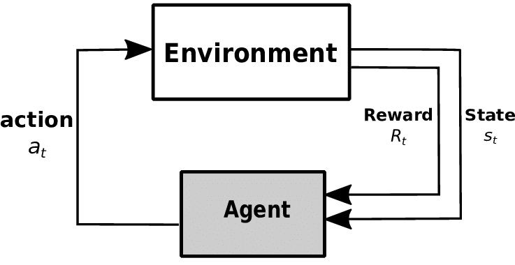

# RL: The true AI

Reinforcment learning is the branch of machine learning that tries to find the optimal policy the agent should follow in an environemnt.
The following picture is a summary of a given reinforecment learning environemnt and the actions that an agent take.

## What is this proejct about?

This project is a follow up of this post. It implements some improvements suggested by the Auuthor.
The code implement the Q-learning Algorithm. With some modifications and debugging, we try to improve the performance of the algorithm.

